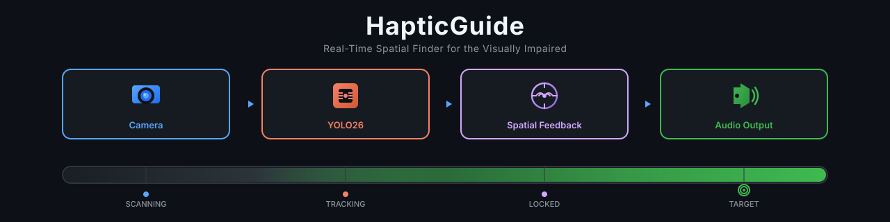
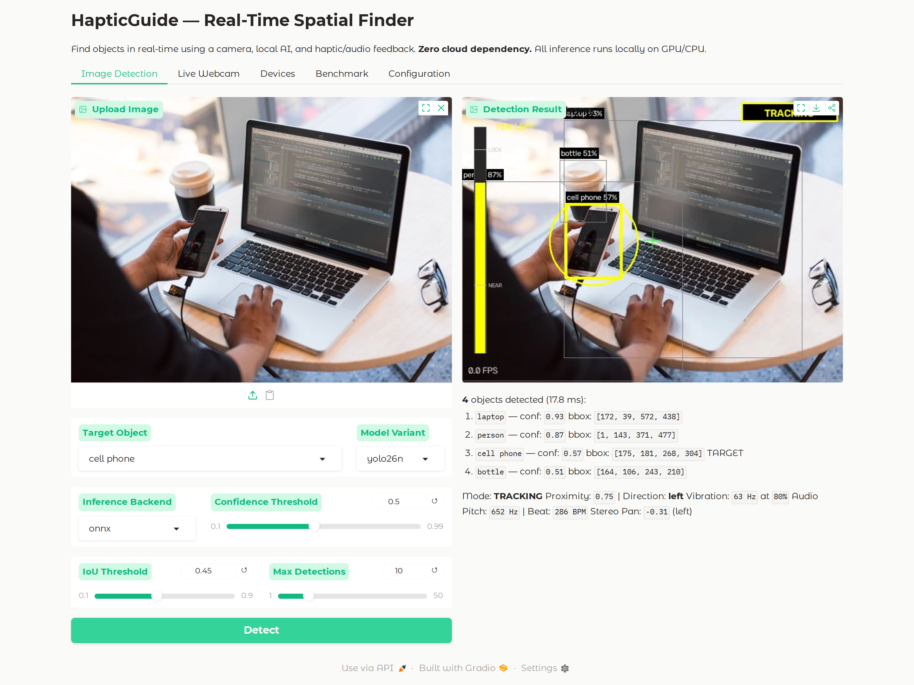
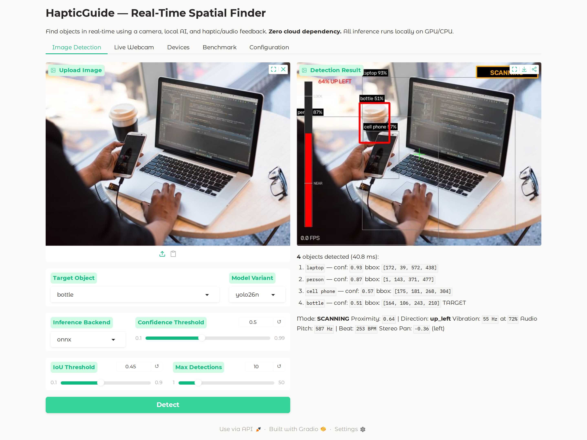
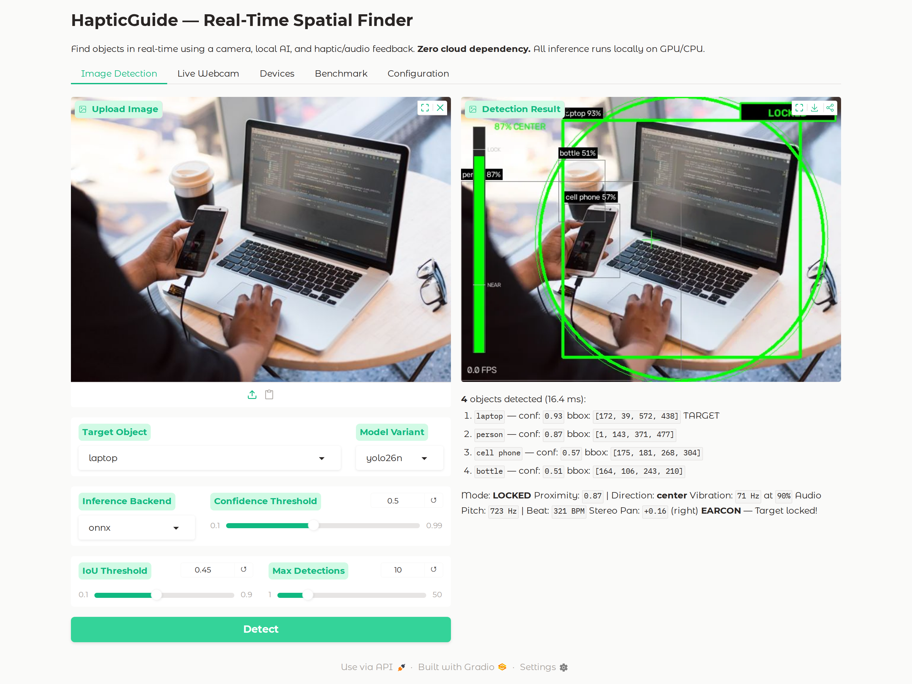
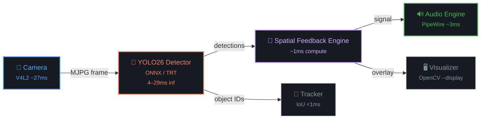

<div align="center">

[](LICENSE)
[](https://www.python.org/)
[](Dockerfile)
[](https://developer.nvidia.com/cuda-toolkit)
[](src/detector.py)
[](https://docs.nvidia.com/datacenter/cloud-native/container-toolkit/latest/install-guide.html)
[](tests/test_core.py)

</div>

# HapticGuide

> Real-Time Spatial Finder for the Visually Impaired — Linux Edition

## Table of Contents
- [What It Does](#what-it-does)
- [Quick Start](#quick-start)
- [Display Window](#display-window)
- [How It Works](#how-it-works)
- [Architecture](#architecture)
- [Feedback Mapping](#feedback-mapping)
- [Model Variants & Benchmarks](#model-variants--benchmarks)
- [Dual-Mode Strategy (YOLOE-26 + YOLO26)](#dual-mode-strategy-yoloe-26--yolo26)
- [Supported Targets](#supported-targets)
- [CLI & Environment Reference](#cli--environment-reference)
- [Dev Tools](#dev-tools)
- [Key Runtime Details](#key-runtime-details)
- [Testing](#testing)
- [Project Structure](#project-structure)
- [Troubleshooting](#troubleshooting)
- [Docker Run (Manual)](#docker-run-manual)
- [License](#license)

## What It Does

HapticGuide helps visually impaired people find objects in real-time using a camera, local AI, and haptic/audio feedback — the **"metal detector" metaphor**:

- Pan your camera across the room
- The app vibrates faster and raises pitch as you get closer to the target
- Stereo panning tells you left vs right
- A distinctive earcon sounds when the target is locked
- **Visual display mode** (`--display`) shows real-time detection overlay for sighted debugging/demo

**Zero cloud dependency.** All inference runs locally on GPU/CPU.

## Quick Start

### Prerequisites

- **Docker** + Docker Compose
- **NVIDIA GPU** + [NVIDIA Container Toolkit](https://docs.nvidia.com/datacenter/cloud-native/container-toolkit/latest/install-guide.html)
- **USB camera** (`/dev/video0`)
- **X11 display** (only needed for `--display` mode — Wayland users need XWayland)

### 1. Build

```bash
./scripts/haptic-guide.sh build
```

First build takes ~5–10 minutes (downloads CUDA base + Python deps + YOLO26n model).

### 2. Run

```bash
# Default: yolo26n, ONNX GPU, camera 0, target "cell phone"
./scripts/haptic-guide.sh run

# Search for a person
TARGET="person" ./scripts/haptic-guide.sh run

# With visual display window (detection overlay)
DISPLAY_MODE=on ./scripts/haptic-guide.sh run

# More accurate model variant
MODEL_VARIANT=yolo26s ./scripts/haptic-guide.sh run

# Combine all options
MODEL_VARIANT=yolo26s TARGET="person" DISPLAY_MODE=on ./scripts/haptic-guide.sh run
```

> **Open-vocabulary scan** (YOLOE-26) is described in the [Dual-Mode Strategy](#dual-mode-strategy-yoloe-26--yolo26) section.

### 3. Gradio Web UI

Browser-based interactive interface for detection, webcam streaming, benchmarking, and device listing.

```bash
# Launch Gradio web UI
./scripts/haptic-guide.sh gradio

# With specific model variant
MODEL_VARIANT=yolo26s ./scripts/haptic-guide.sh gradio

# Via Docker Compose
docker compose run --rm gradio

# Custom port
docker compose run --rm -e GRADIO_PORT=8080 -p 8080:8080 gradio
```

Open **http://localhost:7860** in your browser.



| Tab | Description |
|-----|-------------|
| **Image Detection** | Upload an image, select target & model, run detection with overlay |
| **Live Webcam** | Stream webcam frames through YOLO26 with real-time overlay |
| **Devices** | List available cameras and audio devices |
| **Benchmark** | Run inference benchmarks (variant, backend, iterations) |
| **Configuration** | View current `default.yaml` settings |

### 4. Docker Compose

```bash
# Headless (audio-only)
docker compose run --rm haptic-guide

# With display
docker compose run --rm -e DISPLAY=$DISPLAY haptic-guide --display

# With custom target
docker compose run --rm haptic-guide --target "person" --display
```

Docker Compose handles GPU, camera, audio, and X11 passthrough automatically.

## Display Window

When `--display` is active, the window shows:

- **Green boxes** on target objects with confidence %
- **Gray boxes** on other detections
- **Proximity bar** (left side) — fills as you get closer
- **Mode indicator** (top-right) — SCANNING / TRACKING / LOCKED
- **Crosshair** at frame center
- **FPS counter** (bottom-left)

| SCANNING | TRACKING | LOCKED |
|----------|----------|--------|
|  |  |  |

Press **q** or **ESC** in the window to quit.

> **Note:** First run with display takes ~15s extra to install X11 dependencies. Subsequent runs skip this (libs are cached in the image after rebuild).

## How It Works

HapticGuide runs a continuous **sense → infer → feedback** loop:

1. **Capture** — V4L2 camera grabs frames at ~30 FPS (MJPG, ~27ms per frame)
2. **Detect** — YOLO26 inference finds objects in each frame (4–29ms depending on variant)
3. **Locate** — The spatial engine computes distance and direction from the target to frame center (~1ms)
4. **Feedback** — Audio pitch, beat rate, stereo pan, and vibration intensity all increase as you approach the target

The result: **pan your camera like a metal detector** — the feedback intensifies as you get closer, and a distinctive earcon sounds when the target is locked at center.

**Zero cloud dependency.** All inference runs locally on GPU (or CPU with reduced FPS).

## Architecture



## Feedback Mapping

| Target Proximity | Vibration | Audio Pitch | Audio Beat | Stereo |
|-----------------|----------|-------------|------------|--------|
| Not visible | None | None | None | — |
| Far from center | 10Hz, 20% | 200Hz | 60 BPM | Panned |
| Getting closer | 40Hz, 60% | 500Hz | 180 BPM | Narrowing |
| Near center | 70Hz, 80% | 600Hz | 300 BPM | Centered |
| Locked on | 80Hz, 100% | Earcon | Sustained | Center |

## Model Variants & Benchmarks

**Inference-only:** 100 iterations, synthetic 640×640 frames, ONNX FP32 CUDA.
**E2E:** 200 iterations, MJPG 640×480 real camera, full pipeline (camera → inference → feedback).

| Variant | Params | GFLOPs | Infer (ms) | FPS | E2E FPS | Use Case |
|---------|--------|--------|------------|-----|----------|----------|
| **yolo26n** | 2.6M | 5.4 | **4.68** | **213** | ~30 | Real-time (default, recommended) |
| **yolo26s** | 9.5M | 20.7 | **6.13** | **163** | ~30 | Better accuracy, real-time GPU |
| **yolo26m** | 20.4M | 68.2 | **12.00** | **83** | ~30 | GPU-only real-time |
| yolo26l | 24.8M | 86.4 | 15.09 | 66 | — | High accuracy (GPU) |
| yolo26x | 55.7M | 193.9 | 29.14 | 34 | — | Research / offline |

> **Camera bottleneck:** All variants saturate at the same E2E FPS (~30) because MJPG decode/capture dominates (~27ms). Switching to a faster capture path (V4L2 DmaBuf or lower resolution) would reveal per-model E2E differences. Inference-only is the true GPU throughput metric.

### YOLO26n — Backend Comparison

| Backend | Inference Only | E2E | E2E FPS |
|---------|---------------|-----|---------|
| **ONNX FP32 CUDA** | 4.68ms | 32.99ms | ~30 |
| PyTorch FP16 | ~12ms | ~14ms | ~71 |
| ONNX FP32 CPU | ~43ms | ~48ms | ~21 |

> ONNX GPU is **~2.5× faster** than PyTorch FP16 for inference on this hardware.

With `--display` window active (YOLO26n): **55–60 FPS** (display rendering adds ~5ms overhead).

**YOLO26 key feature**: Native end-to-end (NMS-free) inference via one-to-one head.
Default output shape: `(1, 300, 6)` — no post-processing NMS needed.

## Dual-Mode Strategy (YOLOE-26 + YOLO26)

| Mode | Model | Latency | Purpose |
|------|-------|---------|---------|
| SCAN | YOLOE-26 (open-vocab) | ~100ms GPU | "Find my wallet" via text prompt |
| TRACK | YOLO26n (e2e) | ~6ms GPU | Continuous real-time tracking |

## Supported Targets

YOLO26 detects **COCO 80 classes** by default. Common targets:

| Category | Examples |
|----------|----------|
| People | `person` |
| Electronics | `cell phone`, `laptop`, `tv`, `mouse`, `keyboard`, `remote` |
| Furniture | `chair`, `couch`, `bed`, `dining table` |
| Kitchen | `bottle`, `cup`, `fork`, `knife`, `spoon`, `bowl` |
| Food | `banana`, `apple`, `orange`, `sandwich`, `pizza` |
| Vehicles | `car`, `bicycle`, `motorcycle`, `bus`, `truck` |
| Animals | `dog`, `cat`, `bird`, `horse` |
| Accessories | `backpack`, `umbrella`, `handbag`, `tie` |

For the full list, see the [COCO class mapping](src/detector.py) or the [Ultralytics COCO class reference](https://docs.ultralytics.com/datasets/detect/coco/).

## CLI & Environment Reference

| Flag | Env Variable | Default | Description |
|------|--------------|---------|-------------|
| `--display` | — | `off` | Show real-time detection overlay window (requires X11) |
| `--no-audio` | — | `off` | Disable audio feedback (silent/visual-only mode) |
| `--target "person"` | `TARGET` | `cell phone` | Set target object class |
| `--model-variant yolo26s` | `MODEL_VARIANT` | `yolo26n` | Choose model variant (n/s/m/l/x) |
| `--backend onnx` | `INFERENCE_BACKEND` | `onnx` | Set inference backend (pytorch / onnx / tensorrt) |
| `--camera 1` | `CAMERA_DEVICE` | `0` | Set camera device index |
| `--config configs/custom.yaml` | — | — | Load custom config file |
| `--list-cameras` | — | — | List available cameras and exit |
| `--list-audio` | — | — | List audio devices and exit |
| — | `DISPLAY_MODE` | `off` | `on` = enable X11 overlay window |
| — | `GRADIO_MODE` | `off` | `on` = launch Gradio web UI instead of CLI |
| — | `GRADIO_PORT` | `7860` | Gradio web UI port |

## Dev Tools

```bash
./scripts/haptic-guide.sh build       # Build Docker image
./scripts/haptic-guide.sh run         # Run app (CLI)
./scripts/haptic-guide.sh gradio      # Launch Gradio web UI
./scripts/haptic-guide.sh shell       # Shell into container
./scripts/haptic-guide.sh benchmark   # Benchmark inference latency
./scripts/haptic-guide.sh download    # Download model variant
./scripts/haptic-guide.sh devices     # List cameras & audio devices
```

## Key Runtime Details

| Topic | Detail |
|-------|--------|
| **ONNX GPU** | `LD_LIBRARY_PATH` must include `nvidia/cudnn/lib` and `nvidia/cu13/lib` (pip-installed CUDA/cuDNN libs). Docker Compose sets this automatically. |
| **Model persistence** | ONNX export saves to `./models/yolo26n.onnx` (volume-mounted). First run exports (~15s), subsequent runs load instantly. |
| **Display deps** | The `entrypoint.sh` auto-installs Qt5 XCB libs when `DISPLAY` is set. After image rebuild, these are pre-installed and no runtime install is needed. |
| **half_precision** | Default `false` in `configs/default.yaml`. ONNX FP32 is faster on GPU than FP16. Set `true` only for PyTorch backend. |
| **Volume mounts** | `src/`, `configs/`, `scripts/`, `tests/`, and `models/` are all volume-mounted — code changes take effect immediately without rebuild. |

## Testing

```bash
# Via docker with volume mounts (no rebuild needed):
docker run --rm --gpus all \
  -e LD_LIBRARY_PATH=/opt/venv/lib/python3.12/site-packages/nvidia/cudnn/lib:/opt/venv/lib/python3.12/site-packages/nvidia/cu13/lib:/usr/local/cuda/lib64 \
  -v $(pwd)/src:/app/src \
  -v $(pwd)/tests:/app/tests \
  --entrypoint python3 haptic-guide:latest -m pytest tests/ -v
```

All 12 tests pass (11 unit + 1 integration with GPU inference).

## Project Structure

```
haptic-guide/
├── Dockerfile              # Ubuntu 24.04 + CUDA 12.8 + Qt5 XCB
├── docker-compose.yml      # GPU + camera + audio + X11 passthrough (CLI + Gradio services)
├── requirements.txt        # Python dependencies
├── configs/
│   └── default.yaml        # Runtime configuration
├── docs/
│   └── screenshots/        # README UI screenshots (real YOLO detection via Gradio)
├── models/                 # Downloaded/exported models (persisted via volume)
├── scripts/
│   ├── entrypoint.sh       # Container entrypoint (auto-installs X11 deps, routes CLI/Gradio)
│   ├── haptic-guide.sh     # Build, run, gradio, shell, benchmark CLI
│   ├── dev_tools.py        # Download, export, benchmark tools
│   └── capture_gradio_screenshots.py  # Capture real detection screenshots via Playwright
├── src/
│   ├── __init__.py
│   ├── main.py             # App entry point + CLI (--display, --no-audio)
│   ├── gradio_app.py       # Gradio web UI (image detection, webcam, benchmark, devices)
│   ├── detector.py         # YOLO26 inference (PyTorch/ONNX/TRT)
│   ├── feedback_engine.py  # Spatial → haptic/audio mapping
│   ├── audio_engine.py     # Real-time spatial audio output
│   ├── camera.py            # Low-latency V4L2 camera capture
│   ├── tracker.py           # IoU centroid object tracker
│   └── visualizer.py        # OpenCV detection overlay (--display mode)
└── tests/
    └── test_core.py         # Unit + integration tests
```

## Troubleshooting

| Problem | Fix |
|---------|-----|
| `libcudnn.so.9: not found` | Add to LD_LIBRARY_PATH: `/opt/venv/lib/python3.12/site-packages/nvidia/cudnn/lib` |
| `libcudart.so.13: not found` | Add to LD_LIBRARY_PATH: `/opt/venv/lib/python3.12/site-packages/nvidia/cu13/lib` |
| `Qt platform plugin "xcb" could not load` | Run with `DISPLAY` set, or `apt install` the Qt5 XCB libs (see `scripts/entrypoint.sh`) |
| `QFontDatabase: Cannot find font directory` | `apt install fonts-dejavu-core` |
| `Cannot open camera` | Check `ls /dev/video*` and pass `--device /dev/videoN` |
| X11 display not working | Run `xhost +local:docker` on host, ensure `DISPLAY` env is set |
| Container crash-looping | `docker-compose.yml` uses `restart: "no"` — check logs with `docker compose logs` |
| ONNX model re-exports every run | Ensure `./models/` volume is mounted so `yolo26n.onnx` persists |
| `unrecognized arguments: --display` | Rebuild image, or ensure `./src/` is volume-mounted (docker-compose does this by default) |
| `PortAudioError: Error querying device` | No audio device in container. Add `--device /dev/snd` + PulseAudio socket mount, or use `--no-audio` to run silently. Audio engine now auto-degrades to silent mode if no device is found. |

## Docker Run (Manual)

Prefer `docker compose run` or `./scripts/haptic-guide.sh run` — they handle all passthrough flags automatically.

<details>
<summary>Click to expand — full docker run commands</summary>

```bash
# With audio + display
docker run --rm --gpus all \
  --device /dev/video0 \
  --device /dev/snd \
  -e DISPLAY=$DISPLAY \
  -v /tmp/.X11-unix:/tmp/.X11-unix \
  -e XAUTHORITY=/root/.Xauthority \
  -v ${XAUTHORITY:-/dev/null}:/root/.Xauthority \
  -e QT_X11_NO_MITSHM=1 \
  -e PULSE_SERVER=unix:/run/user/1000/pulse/native \
  -v /run/user/1000/pulse:/run/user/1000/pulse \
  -e LD_LIBRARY_PATH=/opt/venv/lib/python3.12/site-packages/nvidia/cudnn/lib:/opt/venv/lib/python3.12/site-packages/nvidia/cu13/lib:/usr/local/cuda/lib64 \
  -v $(pwd)/models:/app/models \
  haptic-guide:latest --display --target "person"

# Without audio (visual-only / no sound device available)
docker run --rm --gpus all \
  --device /dev/video0 \
  -e DISPLAY=$DISPLAY \
  -v /tmp/.X11-unix:/tmp/.X11-unix \
  -e XAUTHORITY=/root/.Xauthority \
  -v ${XAUTHORITY:-/dev/null}:/root/.Xauthority \
  -e QT_X11_NO_MITSHM=1 \
  -e LD_LIBRARY_PATH=/opt/venv/lib/python3.12/site-packages/nvidia/cudnn/lib:/opt/venv/lib/python3.12/site-packages/nvidia/cu13/lib:/usr/local/cuda/lib64 \
  -v $(pwd)/models:/app/models \
  haptic-guide:latest --display --no-audio --target "person"

# Gradio web UI
docker run --rm --gpus all \
  --device /dev/video0 \
  --network host \
  -e GRADIO_MODE=on \
  -e LD_LIBRARY_PATH=/opt/venv/lib/python3.12/site-packages/nvidia/cudnn/lib:/opt/venv/lib/python3.12/site-packages/nvidia/cu13/lib:/usr/local/cuda/lib64 \
  -v $(pwd)/models:/app/models \
  haptic-guide:latest
```

</details>

## License

MIT — see [LICENSE](LICENSE)
